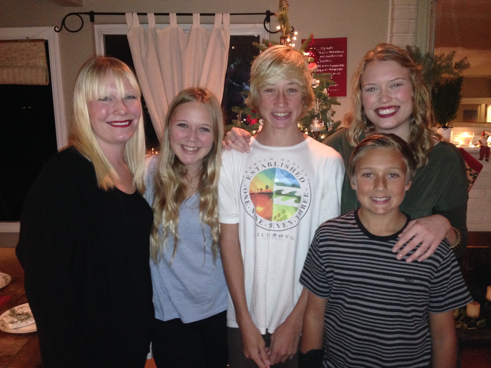
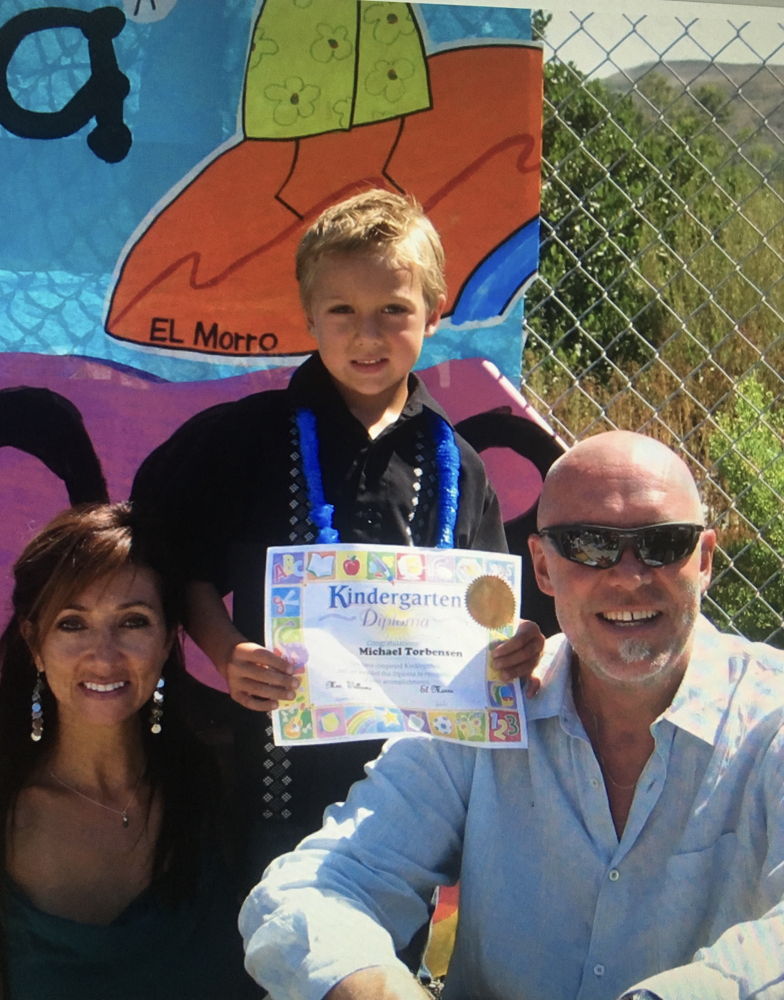
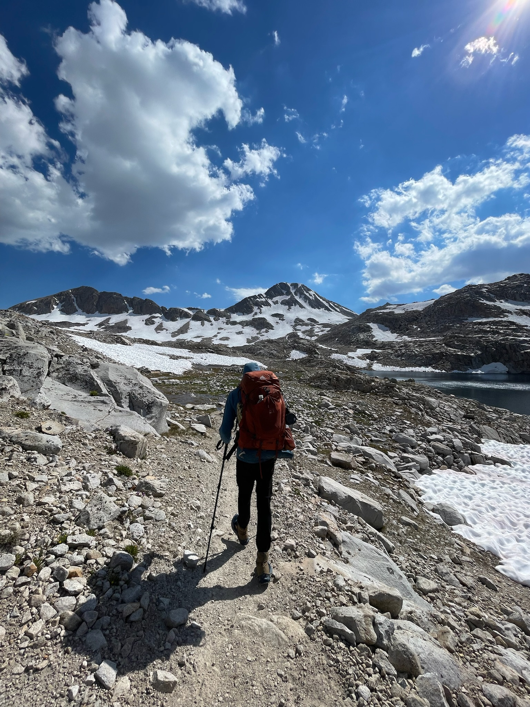

## Background/Family

 
My name is Michael, and yes just Michael because I have yet to resonate with Mike as a nickname. I grew up surrounded by a pretty large and loving family which consisted of 3 fabulous sisters (2 of which lived in Denmark until 2016) and 1 wicked brother, me being the youngest of all 5. My father, the viking Danish man, is an entrepreneur who lives for sailing while my mother, a beautiful Spanish woman, is a nurse who lives for her children.

 

No matter on the boat or off the boat, I was always met with laughter and smiles. I truly could not have surfaced anywhere near where I am today without the support from my parents, especially my mother.

A quick mention to my great-grandfather, on my mothers side, who was a grandmaster in chess and coached me from a very young age. Playing chess and board games was a large part of my childhood and will most likely continue on for the rest of my life. We'll see if I can live up to his title one day!

 

## Life Outside of School

 
I don't even know where to start when talking about my "typical" hobbies. I feel as though I'm a crab molting through different shells each year. I started out mostly going to the beach, surfing, bodyboarding, or taking wave photography. Then, my love for the mountains began to bloom around the age of 16. I began traveling around California visiting as many local campsites as I could. A frequent spot for me was Anza Borrego as it has endless canyons, dunes, caves, and interesting ecological niches (check out my interactive map if you'd like to see more camping spots in CA). I guess the mountains really do have my heart now, especially after completing the John Muir Trail. 

At this point in my life, I really enjoy slack-lining, rock climbing, trail running, and doing any possible restoration volunteer work. I love to be outdoors and I also love finding new ways to mitigate human impacts on natural systems and ecological systems. 

## Career Goals 

Having been raised in a beach town where environmental policies and regulations play a key role in shaping local laws, I was subjected to lot's of local knowledge about how biologically diverse the ecosystems around the town are and what everyone needed to do to protect them. So, there were lots of restoration projects and conservation plans to keep the city healthy and happy. Up to this point, my career goals have been very lax and ambiguous. I've mostly ebbed with the flow and taken a slew of environmental courses, especially at the Santa Barbara city college. Environmental studies is truly a special multidisciplinary field that has so many niches for people to fill. To be honest, it's hard to take environmental studies courses and not get a little sad or frustrated every now and again. But, I feel like this is one of the bigger drivers for me. Fighting to protect these ecological systems that we love and rely on to provide us with not only provisions and medicine, but also a sense of belonging and so many forms of happiness.  

Over the last 6 years in college, I've gotten to know so many wonderful people and make connections with some incredibly gifted professors. Along with that, the environmental based curriculum has widened my vision of what possible careers I can enter myself into. At one point, this was an obstruction to making any long-term plans. Now, it's shaped into a driver of my career aspirations. Throughout my time at UCSB, and with a little more still coming, that hazy future has begun to clear up. 

In the near future, I'm hoping to go on a study abroad trip out to Japan to study aquatic biology and conservation tactics. There, I will obtain 14-16 credits and satisfy my whole entire outside concentration section for graduation. After that, I will only have one quarter left at UCSB. So, from here on out...I have to make the most of it and take any chances I can!

